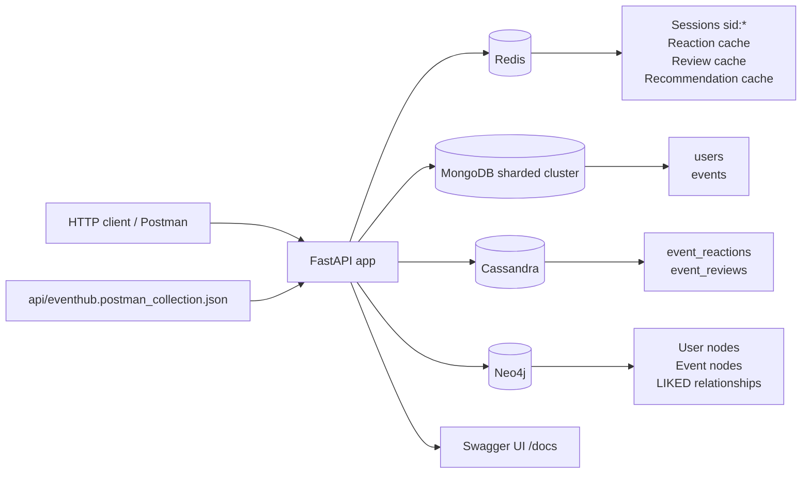
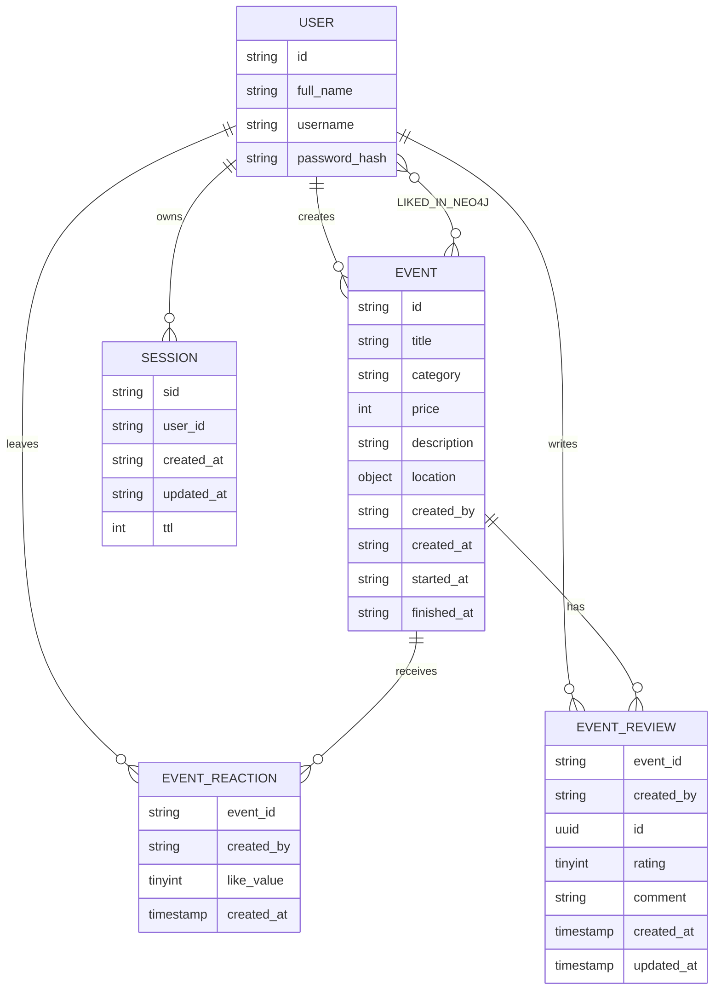
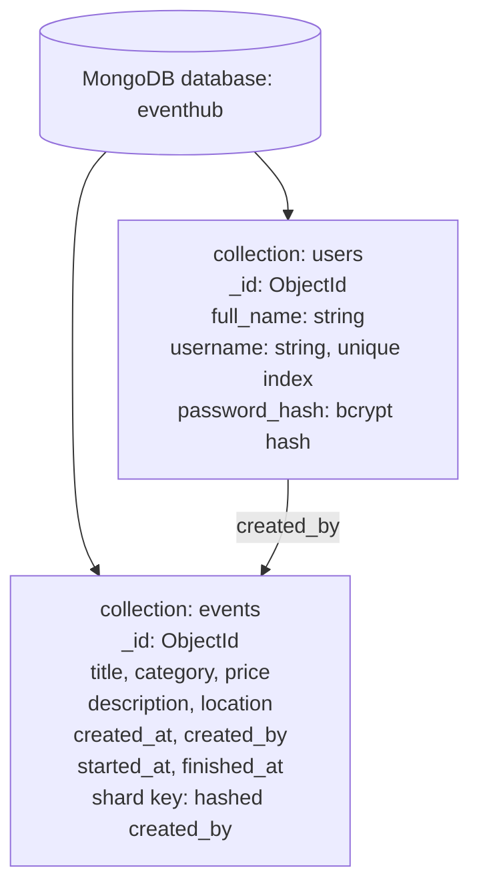
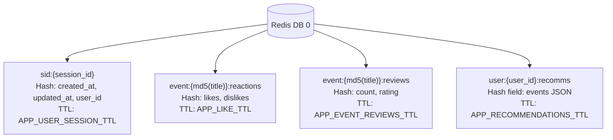
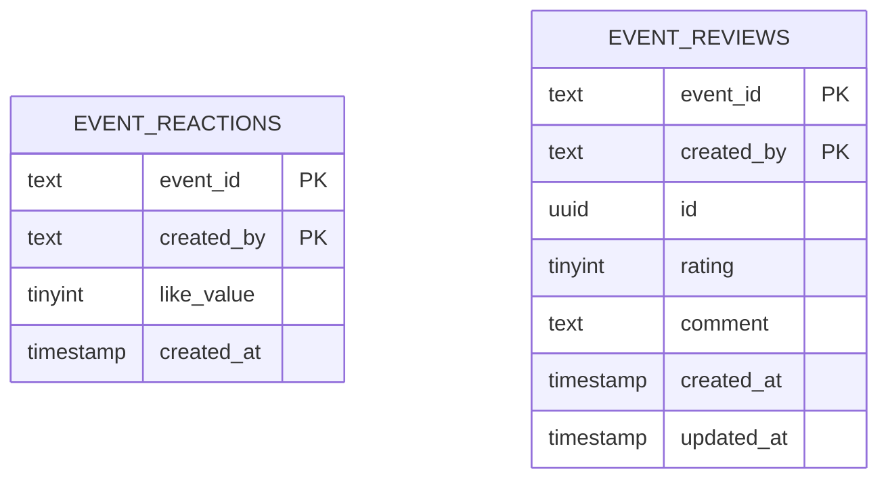
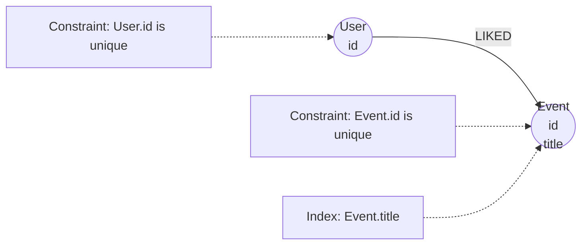
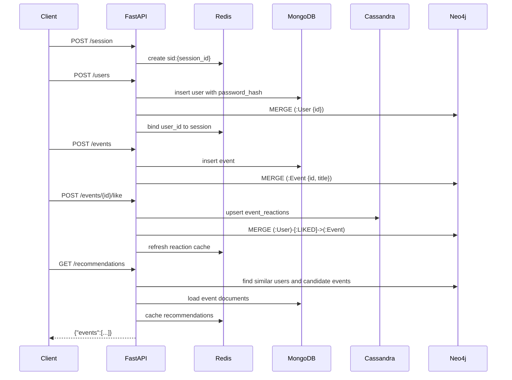

# EventHub

[](https://github.com/Spynch/ndbx/actions/workflows/eventhub.yml)


EventHub - backend-сервис для управления мероприятиями, пользовательскими сессиями, реакциями, отзывами и рекомендациями. Проект демонстрирует практическое использование нескольких NoSQL-хранилищ под разные типы данных: MongoDB, Redis, Cassandra и Neo4j.

## Содержание

1. [Технологический стек](#технологический-стек)
2. [Архитектура проекта](#архитектура-проекта)
3. [Runtime и хранилища данных](#runtime-и-хранилища-данных)
4. [Функциональные требования и use cases](#функциональные-требования-и-use-cases)
5. [Детали реализации](#детали-реализации)
6. [API](#api)
7. [Инструкция по запуску](#инструкция-по-запуску)
8. [Конфигурация](#конфигурация)
9. [Тестирование](#тестирование)

## Технологический стек

| Компонент | Версия / инструмент | Назначение |
|-----------|---------------------|------------|
| Язык | Python 3.12 | Основной язык backend-сервиса. |
| Web framework | FastAPI 0.115.0 | HTTP API, роутинг, Swagger UI. |
| ASGI server | Uvicorn 0.30.6 | Запуск FastAPI-приложения. |
| Сборка и запуск | Docker, Docker Compose, Makefile | Подъем приложения и всех NoSQL-хранилищ одной командой. |
| Зависимости | `requirements.txt`, `pip` | Фиксация Python-библиотек. |
| MongoDB | MongoDB 8.0, sharded cluster | Основное документное хранилище пользователей и мероприятий. |
| Redis | Redis 7.4 Alpine | Сессии, TTL, кеш реакций, отзывов и рекомендаций. |
| Cassandra | Cassandra 5.0 | Запись реакций и отзывов с доступом по `event_id`. |
| Neo4j | Neo4j 5.24 Community | Граф пользователей, мероприятий и связей `LIKED` для рекомендаций. |

Основные библиотеки Python:

| Библиотека | Назначение |
|------------|------------|
| `fastapi` | Объявление HTTP endpoint-ов и генерация локального Swagger UI. |
| `uvicorn` | ASGI runtime для запуска приложения. |
| `redis` | Работа с Redis: сессии и кеши. |
| `pymongo` | Работа с MongoDB: пользователи и мероприятия. |
| `cassandra-driver` | Работа с Cassandra: реакции и отзывы. |
| `neo4j` | Работа с Neo4j: узлы пользователей/мероприятий и рекомендации. |
| `bcrypt` | Хеширование пользовательских паролей. |

## Архитектура проекта

### Структура пакетов и модулей

```text
app/
  main.py                 Точка входа FastAPI, lifecycle, подключение роутов.
  config.py               Чтение и валидация env-переменных.
  storage.py              Фабрики клиентов Redis, MongoDB, Cassandra и Neo4j.
  session.py              Генерация, хранение, продление и удаление сессий.
  http_utils.py           Общая валидация входных данных и сериализация ответов.
  reactions.py            Доменная логика лайков/дизлайков и кеша реакций.
  reviews.py              Доменная логика отзывов и кеша агрегированной оценки.
  recommendations.py      Построение и кеширование рекомендаций.
  neo4j_graph.py          Cypher-запросы к Neo4j.
  routes/
    auth.py               Регистрация, login, logout.
    health_session.py     Healthcheck и создание/продление сессии.
    events.py             CRUD-подобные операции с мероприятиями и реакции.
    reviews.py            Endpoint-ы отзывов.
    recommendations.py    Endpoint рекомендаций.
    users.py              Просмотр пользователей и их мероприятий.

api/
  eventhub.postman_collection.json  Postman-коллекция для ручной проверки API.
  openapi.yaml                      Ручная OpenAPI-спецификация с примерами.

mongo/
  init-mongo.sh           Инициализация replica set-ов и sharded cluster.
  init-databases.sh       Создание баз MongoDB.
  schema.js               Коллекции, индексы и shard key.

cassandra/
  init-cassandra.sh       Применение CQL-схемы.
  schema.cql              Keyspace, таблицы реакций и отзывов.

neo4j-init/
  init-neo4j.sh           Применение Cypher-схемы.
  schema.cypher           Constraints и индексы Neo4j.

docker-compose.yml        Описание приложения и всех инфраструктурных сервисов.
Dockerfile                Образ Python-приложения.
Makefile                  Удобные команды запуска, логов, shell и проверок.
.env.local                Локальная конфигурация окружения.
requirements.txt          Python-зависимости.
```

### Схема взаимодействия компонентов



### Основные сущности и связи



Физическое распределение данных:

| Сущность / данные | Хранилище | Почему здесь |
|-------------------|-----------|--------------|
| Пользователи | MongoDB `users` | Документная модель, уникальный индекс по `username`, поиск по имени. |
| Мероприятия | MongoDB `events` | Гибкий документ события, фильтры по категории, цене, городу и дате. |
| Сессии | Redis `sid:{session_id}` | Быстрый доступ, автоматическое истечение по TTL. |
| Кеш реакций | Redis `event:{hash}:reactions` | Временный агрегат лайков и дизлайков. |
| Кеш отзывов | Redis `event:{hash}:reviews` | Временный агрегат количества отзывов и средней оценки. |
| Кеш рекомендаций | Redis `user:{user_id}:recomms` | Короткоживущий результат рекомендаций пользователя. |
| Реакции | Cassandra `event_reactions` | Записи по ключу `(event_id, created_by)`, чтение реакций мероприятия. |
| Отзывы | Cassandra `event_reviews` | Один отзыв пользователя на мероприятие, чтение списка по `event_id`. |
| Рекомендательный граф | Neo4j `(:User)-[:LIKED]->(:Event)` | Поиск пользователей с похожими лайками и кандидатов для рекомендаций. |

### Схема хранения данных по БД

MongoDB хранит долгоживущие документы пользователей и мероприятий:



Redis хранит временные ключи с TTL:



Cassandra хранит записи, оптимизированные под чтение по `event_id`:



Neo4j хранит граф интересов для рекомендаций:



## Runtime и хранилища данных

### Службы Docker Compose

Через [docker-compose.yml](docker-compose.yml) поднимается не только приложение, но и полный локальный контур данных:

| Служба | Назначение |
|--------|------------|
| `app` | FastAPI-приложение на Python. |
| `redis` | Redis для сессий и временных агрегатов. |
| `cassandra-test` | Cassandra для реакций и отзывов. |
| `cassandra-init` | Одноразовое применение CQL-схемы. |
| `neo4j` | Neo4j для графа рекомендаций. |
| `neo4j-init` | Одноразовое применение Cypher-схемы. |
| `mongo-cfg-1..3` | Config server replica set MongoDB. |
| `mongo-shard1-1..3` | Первый shard replica set MongoDB. |
| `mongo-shard2-1..3` | Второй shard replica set MongoDB. |
| `mongos` | Точка входа приложения в MongoDB cluster. |
| `mongo-init` | Одноразовая настройка replica set-ов, sharding, коллекций и индексов. |

Приложение стартует после готовности базовых сервисов через `depends_on` с healthcheck-условиями. На уровне самого приложения есть дополнительный retry-loop подключения к MongoDB, Cassandra и Neo4j.

### Внутренний старт приложения

При запуске выполняется [main.py](app/main.py):

1. Читаются и валидируются env-переменные через `Settings.from_env()`.
2. Создаются клиенты Redis, MongoDB и Neo4j.
3. В lifecycle FastAPI проверяется доступность MongoDB.
4. Создается Cassandra cluster/session и выбирается `CASSANDRA_KEYSPACE`.
5. Проверяется подключение к Neo4j через `verify_connectivity()`.
6. Если хранилища еще не готовы, приложение повторяет подключение.
7. При остановке закрываются клиенты Redis, MongoDB, Neo4j и Cassandra.

Количество попыток задает `APP_STARTUP_RETRY_ATTEMPTS`, паузу между ними задает `APP_STARTUP_RETRY_DELAY_SECONDS`.

### MongoDB

MongoDB хранит основные документы приложения:

| Коллекция | Основные поля | Индексы и особенности |
|-----------|---------------|-----------------------|
| `users` | `_id`, `full_name`, `username`, `password_hash` | `username` уникален; `full_name` индексируется для поиска. Пароль хранится только как bcrypt-хеш. |
| `events` | `_id`, `title`, `category`, `price`, `description`, `location.address`, `location.city`, `created_at`, `created_by`, `started_at`, `finished_at` | Коллекция шардируется по hashed `created_by`; есть индексы по названию, автору, категории, цене, городу и дате начала. |

База задается переменной `MONGODB_DATABASE`; локально это `eventhub`.

### Redis

Redis хранит только быстрые временные данные:

| Ключ | Содержимое | TTL |
|------|------------|-----|
| `sid:{session_id}` | `created_at`, `updated_at`, опциональный `user_id` | `APP_USER_SESSION_TTL` |
| `event:{md5(title)}:reactions` | `likes`, `dislikes` | `APP_LIKE_TTL` |
| `event:{md5(title)}:reviews` | `count`, `rating` | `APP_EVENT_REVIEWS_TTL` |
| `user:{user_id}:recomms` | поле `events` с готовым JSON-списком рекомендаций | `APP_RECOMMENDATIONS_TTL` |

Название мероприятия в ключах реакций и отзывов превращается в md5-хеш, чтобы ключи были короткими и безопасными для Redis.

### Cassandra

Cassandra хранит данные, которые читаются по `event_id`:

| Таблица | Primary key | Назначение |
|---------|-------------|------------|
| `event_reactions` | `(event_id, created_by)` | Текущая реакция пользователя на мероприятие. `like_value = 1` означает лайк, `-1` означает дизлайк. |
| `event_reviews` | `(event_id, created_by)` | Один отзыв пользователя на мероприятие с `id`, `rating`, `comment`, `created_at`, `updated_at`. |

Такой ключ означает, что один пользователь может иметь только одну текущую реакцию и один отзыв на конкретное мероприятие. Повторная реакция обновляет запись, а второй отзыв блокируется условной вставкой `IF NOT EXISTS`.

### Neo4j

Neo4j хранит рекомендательный граф:

```text
(:User {id})-[:LIKED]->(:Event {id, title})
```

В графе есть constraints на уникальность `User.id` и `Event.id`, а также индекс по `Event.title`.

Связь `LIKED` создается при лайке. В текущей реализации дизлайк меняет текущую реакцию в Cassandra, но не удаляет историческую связь `LIKED` из Neo4j. Это важно учитывать при интерпретации рекомендаций: граф отражает проявленный интерес, а Cassandra хранит текущую реакцию.

## Функциональные требования и use cases

| Use case | Что делает сервис | Основные endpoint-ы |
|----------|-------------------|---------------------|
| Проверить доступность | Клиент проверяет, что приложение отвечает. | `GET /health` |
| Создать гостевую сессию | Посетитель получает cookie `X-Session-Id`; повторный вызов продлевает TTL. | `POST /session` |
| Зарегистрировать пользователя | Сервис валидирует данные, хеширует пароль, создает пользователя в MongoDB, узел в Neo4j и авторизованную сессию. | `POST /users` |
| Войти и выйти | Пользователь входит по `username`/`password`; logout удаляет сессию из Redis. | `POST /auth/login`, `POST /auth/logout` |
| Найти пользователей | Клиент получает список пользователей или конкретного пользователя без `password_hash`. | `GET /users`, `GET /users/{user_id}` |
| Создать мероприятие | Авторизованный пользователь создает мероприятие, которое сохраняется в MongoDB и Neo4j. | `POST /events` |
| Искать мероприятия | Клиент фильтрует мероприятия по названию, id, категории, городу, автору, цене, дате и пагинации. | `GET /events`, `GET /users/{user_id}/events` |
| Изменить мероприятие | Организатор меняет `category`, `price`, `city` своего мероприятия. | `PATCH /events/{event_id}` |
| Поставить реакцию | Авторизованный пользователь ставит лайк или дизлайк; лайк также создает связь в Neo4j. | `POST /events/{event_id}/like`, `POST /events/{event_id}/dislike` |
| Оставить отзыв | Авторизованный пользователь создает или обновляет свой отзыв с рейтингом 1-5. | `POST /events/{event_id}/reviews`, `PATCH /events/{event_id}/reviews/{review_id}` |
| Получить рекомендации | Сервис ищет мероприятия, которые лайкали пользователи с похожими интересами, и кеширует результат. | `GET /recommendations` |

## Детали реализации

### Сессии и авторизация

Сессия нужна, чтобы сервис понимал, какой пользователь делает запрос. Идентификатор хранится в cookie `X-Session-Id`, а данные сессии лежат в Redis.

`POST /session` создает гостевую сессию и возвращает `201`, если cookie нет или сессия отсутствует в Redis. Если cookie указывает на живую сессию, сервис продлевает TTL и возвращает `200`.

`GET /health` не создает сессию. Если cookie уже была в запросе, endpoint возвращает ее обратно с обновленным временем жизни.

### Регистрация, вход и выход

Регистрация через `POST /users` выполняется так:

1. Проверяются `full_name`, `username`, `password`.
2. Пароль хешируется через `bcrypt`.
3. Пользователь сохраняется в MongoDB.
4. В Neo4j создается узел `User`.
5. В Redis создается авторизованная сессия.
6. В ответ выставляется cookie `X-Session-Id`.

Если `username` уже занят, возвращается `409`. Если пользователь был сохранен в MongoDB, но Neo4j не ответил, приложение пытается удалить созданный MongoDB-документ, чтобы не оставить частично созданную сущность.

Вход через `POST /auth/login` ищет пользователя в MongoDB, сравнивает пароль с bcrypt-хешем и привязывает пользователя к текущей сессии либо создает новую. Выход через `POST /auth/logout` удаляет ключ `sid:{session_id}` из Redis и сбрасывает cookie через `Max-Age=0`.

### Мероприятия

`POST /events` доступен только авторизованному пользователю. Клиент передает `title`, `address`, `started_at`, `finished_at` и опционально `description`.

При создании сервис сам проставляет:

| Поле | Значение |
|------|----------|
| `category` | `other` |
| `price` | `0` |
| `created_at` | Текущее UTC-время в RFC3339 |
| `created_by` | ID текущего пользователя |

Даты мероприятия должны быть RFC3339 datetime с timezone, например `2031-01-01T12:00:00+03:00`. После записи в MongoDB создается узел `Event` в Neo4j. Если Neo4j недоступен после успешной записи в MongoDB, приложение пытается удалить созданное мероприятие из MongoDB.

`PATCH /events/{event_id}` доступен только автору мероприятия. Изменить можно `category`, `price`, `city`. Пустой `city` удаляет `location.city`; название, описание, адрес и даты через этот endpoint не меняются.

### Реакции

Лайк и дизлайк доступны только авторизованному пользователю:

| Endpoint | Что происходит |
|----------|----------------|
| `POST /events/{event_id}/like` | Проверяется мероприятие, создается `LIKED` в Neo4j, в Cassandra пишется `like_value = 1`, кеш реакций инвалидируется и пересобирается. |
| `POST /events/{event_id}/dislike` | Проверяется мероприятие, в Cassandra пишется `like_value = -1`, кеш реакций инвалидируется и пересобирается. |

Агрегированные реакции считаются по названию мероприятия. Если есть несколько мероприятий с одинаковым `title`, сводка `likes`/`dislikes` собирается по всем таким мероприятиям.

### Отзывы

Отзывы хранятся в Cassandra и доступны через:

| Endpoint | Назначение |
|----------|------------|
| `POST /events/{event_id}/reviews` | Создать отзыв текущего пользователя. |
| `GET /events/{event_id}/reviews` | Получить отзывы мероприятия с `limit`/`offset`. |
| `PATCH /events/{event_id}/reviews/{review_id}` | Изменить свой отзыв. |

Правила: пользователь должен быть авторизован, рейтинг должен быть от `1` до `5`, комментарий должен быть строкой не длиннее 300 символов, один пользователь может оставить только один отзыв на одно мероприятие. Средняя оценка и количество отзывов считаются по всем мероприятиям с одинаковым названием и временно кешируются в Redis.

### Рекомендации

`GET /recommendations` строит список только для авторизованного пользователя:

1. Сервис ищет готовый список в Redis по ключу `user:{user_id}:recomms`.
2. Если кеша нет, Neo4j ищет пользователей, которые лайкали те же мероприятия.
3. Затем выбираются другие мероприятия, которые лайкали похожие пользователи.
4. Мероприятия, уже лайкнутые текущим пользователем, исключаются.
5. Полные документы мероприятий загружаются из MongoDB.
6. Мероприятия с одинаковым названием объединяются.
7. Список сортируется и сохраняется в Redis.

Сортировка: сначала больше лайков, затем более ранняя дата начала, затем название. Ответ имеет вид `{"events":[]}`; поля `count` в рекомендациях нет.

### Валидация входных данных

Сервис выполняет базовые проверки:

| Данные | Правило |
|--------|---------|
| Обязательные строки | Должны существовать, быть строками и не быть пустыми. |
| MongoDB id | Должен быть валидным `ObjectId`. |
| `limit`, `offset`, `price_from`, `price_to` | Должны быть целыми числами без минуса. |
| `date_from`, `date_to` | Формат `YYYYMMDD`. |
| `started_at`, `finished_at` | RFC3339 datetime с timezone. |
| `category` | Одно из `meetup`, `concert`, `exhibition`, `party`, `other`. |
| `rating` | Целое число от `1` до `5`. |
| `comment` | Строка длиной до 300 символов. |

Типичный ответ на некорректное поле:

```json
{"message":"invalid \"field\" field"}
```

### Основные коды ответов

| Код | Значение |
|-----|----------|
| `200` | Запрос выполнен, данные возвращены. |
| `201` | Объект или сессия созданы. |
| `204` | Запрос выполнен, тела ответа нет. |
| `400` | Некорректные данные в запросе. |
| `401` | Пользователь не авторизован или передал неверные учетные данные. |
| `404` | Объект не найден. |
| `409` | Конфликт состояния, например пользователь или отзыв уже существует. |
| `503` | Одно из хранилищ недоступно. |

### Полный поток данных

Типовой end-to-end сценарий:



## API

Локальные ссылки после запуска проекта:

| Ресурс | Ссылка |
|--------|--------|
| Swagger UI FastAPI | [http://localhost:8080/docs](http://localhost:8080/docs) |
| Автогенерируемый OpenAPI JSON | [http://localhost:8080/openapi.json](http://localhost:8080/openapi.json) |
| Ручная OpenAPI-спецификация с примерами | [api/openapi.yaml](api/openapi.yaml) |
| Postman-коллекция | [api/eventhub.postman_collection.json](api/eventhub.postman_collection.json) |

Важно: так как обработчики читают JSON через `Request`, автогенерируемый Swagger UI полезен для ручных вызовов, но подробные схемы запросов/ответов и примеры зафиксированы в [api/openapi.yaml](api/openapi.yaml) и Postman-коллекции.

### Endpoint-ы

| Метод | Путь | Авторизация | Назначение |
|-------|------|-------------|------------|
| `GET` | `/health` | Нет | Healthcheck приложения. |
| `POST` | `/session` | Нет | Создать или продлить сессию. |
| `POST` | `/users` | Нет | Зарегистрировать пользователя. |
| `POST` | `/auth/login` | Нет | Войти по логину и паролю. |
| `POST` | `/auth/logout` | Да | Удалить текущую сессию. |
| `GET` | `/users` | Нет | Получить список пользователей. |
| `GET` | `/users/{user_id}` | Нет | Получить пользователя по id. |
| `GET` | `/users/{user_id}/events` | Нет | Получить мероприятия пользователя. |
| `POST` | `/events` | Да | Создать мероприятие. |
| `GET` | `/events` | Нет | Получить список мероприятий. |
| `GET` | `/events/{event_id}` | Нет | Получить мероприятие по id. |
| `PATCH` | `/events/{event_id}` | Да, только автор | Изменить часть полей мероприятия. |
| `POST` | `/events/{event_id}/like` | Да | Поставить лайк. |
| `POST` | `/events/{event_id}/dislike` | Да | Поставить дизлайк. |
| `POST` | `/events/{event_id}/reviews` | Да | Создать отзыв. |
| `GET` | `/events/{event_id}/reviews` | Нет | Получить отзывы мероприятия. |
| `PATCH` | `/events/{event_id}/reviews/{review_id}` | Да, только автор отзыва | Изменить отзыв. |
| `GET` | `/recommendations` | Да | Получить рекомендации. |

### Примеры запросов и ответов

Healthcheck:

```bash
curl -i http://localhost:8080/health
```

```http
HTTP/1.1 200 OK
content-type: application/json

{"status":"ok"}
```

Регистрация пользователя и сохранение cookie:

```bash
curl -i -c cookies.txt -X POST http://localhost:8080/users \
  -H "Content-Type: application/json" \
  -d '{"full_name":"Lab User","username":"lab_user","password":"password"}'
```

```http
HTTP/1.1 201 Created
set-cookie: X-Session-Id=0f2e8d4a0c4f4f6a9e1c2b3d4e5f6789; HttpOnly; Max-Age=60; Path=/
```

Создание мероприятия авторизованным пользователем:

```bash
curl -i -b cookies.txt -c cookies.txt -X POST http://localhost:8080/events \
  -H "Content-Type: application/json" \
  -d '{
    "title":"Neo4j meetup",
    "address":"Moscow, Test address",
    "description":"Recommendation demo event",
    "started_at":"2031-01-01T12:00:00+03:00",
    "finished_at":"2031-01-01T14:00:00+03:00"
  }'
```

```json
{"id":"66589ef7e1382301240f8e11"}
```

Поиск мероприятий с агрегатами реакций и отзывов:

```bash
curl -s "http://localhost:8080/events?include=reactions,reviews&title=Neo4j&limit=10&offset=0"
```

```json
{
  "events": [
    {
      "id": "66589ef7e1382301240f8e11",
      "title": "Neo4j meetup",
      "category": "meetup",
      "price": 1000,
      "description": "Recommendation demo event",
      "location": {
        "address": "Moscow, Test address",
        "city": "Moscow"
      },
      "created_at": "2026-06-10T10:00:00Z",
      "created_by": "66589d4de1382301240f8e10",
      "started_at": "2031-01-01T12:00:00+03:00",
      "finished_at": "2031-01-01T14:00:00+03:00",
      "reactions": {
        "likes": 1,
        "dislikes": 0
      },
      "reviews": {
        "count": 1,
        "rating": 5.0
      }
    }
  ],
  "count": 1
}
```

Создание отзыва:

```bash
curl -i -b cookies.txt -c cookies.txt -X POST http://localhost:8080/events/66589ef7e1382301240f8e11/reviews \
  -H "Content-Type: application/json" \
  -d '{"comment":"Good event","rating":5}'
```

```json
{"id":"7a6a5c0e-3d9e-4bb5-bc8c-90fdc0f94f3e"}
```

Получение рекомендаций:

```bash
curl -s -b cookies.txt http://localhost:8080/recommendations
```

```json
{
  "events": [
    {
      "id": "66589ef7e1382301240f8e11",
      "title": "Neo4j meetup",
      "category": "meetup",
      "price": 1000,
      "description": "Recommendation demo event",
      "location": {
        "address": "Moscow, Test address",
        "city": "Moscow"
      },
      "created_at": "2026-06-10T10:00:00Z",
      "created_by": "66589d4de1382301240f8e10",
      "started_at": "2031-01-01T12:00:00+03:00",
      "finished_at": "2031-01-01T14:00:00+03:00"
    }
  ]
}
```

Типовые ошибки:

```json
{"message":"invalid \"title\" field"}
```

```json
{"message":"Not found"}
```

```json
{"detail":"MongoDB is unavailable"}
```

## Инструкция по запуску

### Предварительные требования

1. Установите Docker и Docker Compose.
2. Для команд `make` установите GNU Make. На Windows можно использовать Git Bash, WSL или запускать команды `docker compose` напрямую.
3. Убедитесь, что порты из `.env.local` свободны: `8080`, `6379`, `27017`, `9042`, `7687` и внутренние порты MongoDB replica set-ов.

### Быстрый запуск через Makefile

1. Проверьте или измените настройки в `.env.local`.
2. Запустите приложение и базы данных:

```bash
make run
```

3. Посмотрите состояние контейнеров:

```bash
make services
```

4. Проверьте healthcheck:

```bash
make health
```

5. Откройте Swagger UI:

```text
http://localhost:8080/docs
```

6. Импортируйте Postman-коллекцию из [api/eventhub.postman_collection.json](api/eventhub.postman_collection.json) и запустите сценарии вручную.

### Эквивалентный запуск без Makefile

```bash
docker compose --env-file .env.local up -d --build
```

Проверка:

```bash
curl -i http://localhost:8080/health
```

Остановка без удаления данных:

```bash
docker compose --env-file .env.local down
```

Остановка с удалением volumes:

```bash
docker compose --env-file .env.local down -v --remove-orphans
```

### Полезные команды Makefile

| Команда | Назначение |
|---------|------------|
| `make help` | Показать список доступных команд. |
| `make run` | Запустить все сервисы в фоне с пересборкой. |
| `make rund` | Запустить все сервисы с выводом логов в консоль. |
| `make up` | Запустить сервисы в фоне без пересборки. |
| `make build` | Собрать образ приложения. |
| `make recreate` | Пересоздать контейнеры с пересборкой. |
| `make restart` | Перезапустить все сервисы. |
| `make restart-app` | Перезапустить только приложение. |
| `make services` | Показать состояние контейнеров. |
| `make config` | Сгенерировать итоговую конфигурацию Docker Compose. |
| `make health` | Отправить запрос на `/health`. |
| `make logs` | Смотреть логи всех сервисов. |
| `make logs-app` | Смотреть логи приложения. |
| `make logs-db` | Смотреть основные логи Redis, Cassandra, MongoDB и Neo4j. |
| `make shell-app` | Открыть shell в контейнере приложения. |
| `make shell-mongo` | Открыть `mongosh` в контейнере `mongos`. |
| `make shell-cassandra` | Открыть `cqlsh`. |
| `make shell-neo4j` | Открыть `cypher-shell`. |
| `make shell-redis` | Открыть `redis-cli`. |
| `make check-python` | Скомпилировать Python-файлы. |
| `make verify` | Выполнить локальные проверки `config` и `check-python`. |
| `make stop` | Остановить контейнеры без удаления данных. |
| `make clean` | Остановить контейнеры и удалить volumes. |
| `make reset` | Полностью очистить данные и запустить проект заново. |

## Конфигурация

Все переменные задаются в `.env.local` и прокидываются в Docker Compose. Значения ниже соответствуют текущему локальному файлу.

| Переменная | Описание | Значение по умолчанию |
|------------|----------|----------------------|
| `APP_HOST` | Host, на котором Uvicorn слушает запросы внутри контейнера. | `0.0.0.0` |
| `APP_PORT` | Порт HTTP API. | `8080` |
| `APP_USER_SESSION_TTL` | TTL пользовательской сессии в Redis, секунды. | `60` |
| `APP_LIKE_TTL` | TTL кеша агрегированных реакций, секунды. | `60` |
| `APP_EVENT_REVIEWS_TTL` | TTL кеша агрегированных отзывов, секунды. | `120` |
| `APP_RECOMMENDATIONS_TTL` | TTL кеша рекомендаций пользователя, секунды. | `60` |
| `APP_STARTUP_RETRY_ATTEMPTS` | Количество попыток подключения к MongoDB, Cassandra и Neo4j при старте. | `20` |
| `APP_STARTUP_RETRY_DELAY_SECONDS` | Пауза между startup retry, секунды. | `0.5` |
| `REDIS_HOST` | Host Redis внутри Docker-сети. | `redis` |
| `REDIS_PORT` | Порт Redis. | `6379` |
| `REDIS_PASSWORD` | Пароль Redis; пустое значение отключает auth. | пусто |
| `REDIS_DB` | Номер Redis database. | `0` |
| `MONGO_CFG_RS` | Название config replica set MongoDB. | `cfgReplSet` |
| `MONGO_CFG_1_PORT` | Порт первого config server. | `27101` |
| `MONGO_CFG_2_PORT` | Порт второго config server. | `27102` |
| `MONGO_CFG_3_PORT` | Порт третьего config server. | `27103` |
| `MONGO_SHARD1_RS` | Название первого shard replica set. | `shard1ReplSet` |
| `MONGO_SHARD1_1_PORT` | Порт первого узла shard 1. | `27211` |
| `MONGO_SHARD1_2_PORT` | Порт второго узла shard 1. | `27212` |
| `MONGO_SHARD1_3_PORT` | Порт третьего узла shard 1. | `27213` |
| `MONGO_SHARD2_RS` | Название второго shard replica set. | `shard2ReplSet` |
| `MONGO_SHARD2_1_PORT` | Порт первого узла shard 2. | `27311` |
| `MONGO_SHARD2_2_PORT` | Порт второго узла shard 2. | `27312` |
| `MONGO_SHARD2_3_PORT` | Порт третьего узла shard 2. | `27313` |
| `MONGODB_DATABASE` | Имя рабочей базы MongoDB. | `eventhub` |
| `MONGODB_USER` | Пользователь MongoDB; пустое значение отключает auth в URI. | пусто |
| `MONGODB_PASSWORD` | Пароль MongoDB. | пусто |
| `MONGODB_HOST` | Host MongoDB router `mongos` внутри Docker-сети. | `mongos` |
| `MONGODB_PORT` | Порт `mongos`. | `27017` |
| `CASSANDRA_HOSTS` | Список Cassandra contact points через запятую. | `cassandra-test` |
| `CASSANDRA_PORT` | Порт Cassandra CQL. | `9042` |
| `CASSANDRA_USERNAME` | Пользователь Cassandra; пустое значение отключает auth provider. | пусто |
| `CASSANDRA_PASSWORD` | Пароль Cassandra. | пусто |
| `CASSANDRA_KEYSPACE` | Keyspace приложения. | `testkeyspace` |
| `CASSANDRA_CONSISTENCY` | Consistency level для prepared statements. | `ONE` |
| `CASSANDRA_REPLICATION_CLASS` | Класс репликации keyspace. | `SimpleStrategy` |
| `CASSANDRA_REPLICATION_FACTOR` | Фактор репликации keyspace. | `1` |
| `CASSANDRA_CLUSTER_NAME` | Имя Cassandra cluster. | `eventhub` |
| `CASSANDRA_NUM_TOKENS` | Количество virtual nodes Cassandra. | `16` |
| `CASSANDRA_MAX_HEAP_SIZE` | Максимальный heap Cassandra container. | `512M` |
| `CASSANDRA_HEAP_NEWSIZE` | New generation heap Cassandra container. | `128M` |
| `NEO4J_URL` | Bolt URL Neo4j внутри Docker-сети. | `bolt://neo4j:7687` |
| `NEO4J_BOLT_PORT` | Внешний порт Bolt, проброшенный на host. | `7687` |
| `NEO4J_USERNAME` | Пользователь Neo4j. | `neo4j` |
| `NEO4J_PASSWORD` | Пароль Neo4j. | `password` |

## Тестирование

### Как запустить проверки

Базовая проверка проекта:

```bash
make verify
```

Эквивалентно вручную:

```bash
docker compose --env-file .env.local config
python -m compileall app
```

Ручная API-проверка:

1. Запустите сервис через `make run`.
2. Импортируйте [api/eventhub.postman_collection.json](api/eventhub.postman_collection.json) в Postman.
3. Выполните коллекцию сверху вниз: health, session, registration/login, users, events, reactions, reviews, recommendations, logout.

### Что покрыто

| Тип проверки | Статус в репозитории |
|--------------|----------------------|
| Static/runtime sanity | `make verify` проверяет Docker Compose config и компиляцию Python-модулей. |
| Unit tests | Отдельной директории unit-тестов сейчас нет. |
| Integration tests | Автоматических integration tests сейчас нет; сценарии проверяются через Postman и поднятые контейнеры. |
| Acceptance/manual API tests | Postman-коллекция покрывает основные бизнес-сценарии API. |
| Coverage | Coverage не настроен, поэтому badge явно помечен как `not configured`. |
